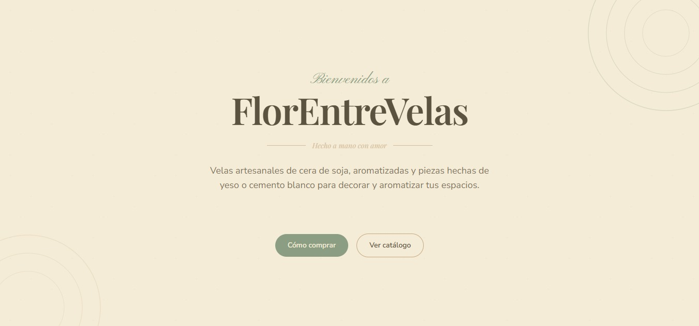
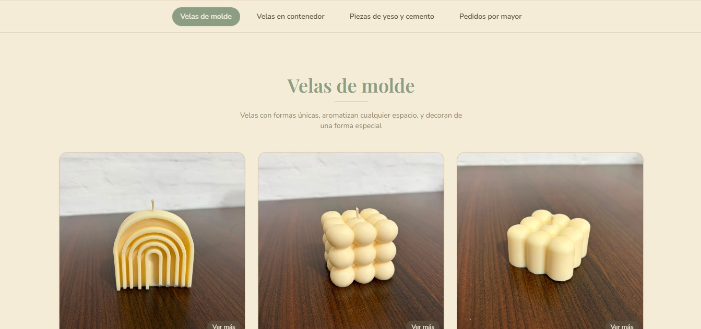
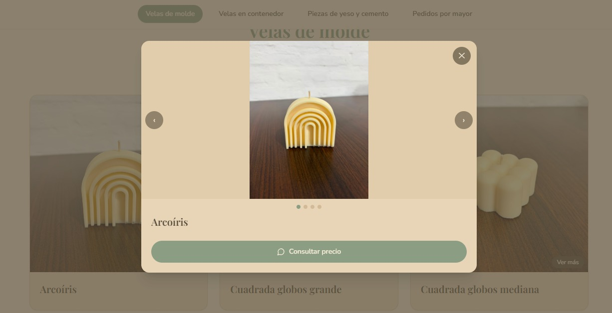
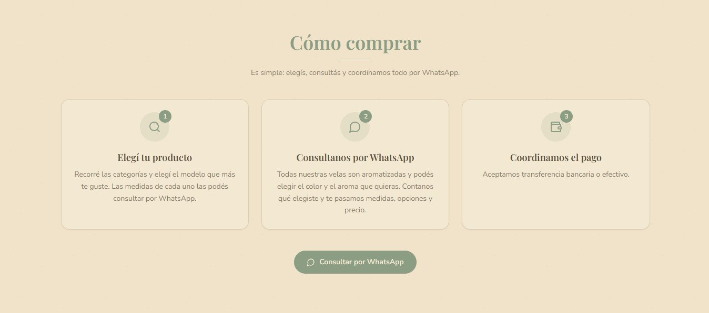

# 🕯️ FlorEntreVelas · Catálogo online

Catálogo web de **FlorEntreVelas**, un emprendimiento de velas de cera de soja y piezas artesanales de yeso y cemento hechas a mano en Resistencia, Chaco.

El sitio reemplaza a los catálogos en PDF y Word que se usaban antes: muestra los productos por categoría, con galería de fotos y video, y cada producto tiene un botón que abre WhatsApp con la consulta ya escrita. Sin carrito ni checkout: la venta se cierra por chat, que es como funciona el negocio en la práctica.

🔗 **Demo:** [florentrevelas-catalogo.vercel.app](https://florentrevelas-catalogo.vercel.app)



---

## ✨ Funcionalidades

- **Catálogo por categorías**: velas de molde, velas en contenedor y piezas de yeso/cemento blanco, con navegación rápida entre secciones.
- **Modal de producto** con galería de imágenes y video opcional.
- **Consulta por WhatsApp** desde cada producto: el enlace `wa.me` se genera con `buildWhatsAppLink` y el mensaje ya incluye el nombre del producto consultado.
- **Sección "Cómo comprar"** que explica el proceso de pedido.
- **Diseño responsive**, pensado principalmente para celular (de ahí llega la mayoría del tráfico, vía Instagram).
- **Identidad visual "Vainilla & Sage"** aplicada con Tailwind.

## 📸 Capturas

| Categorías | Detalle de producto | Cómo comprar |
|---|---|---|
|  |  |  |

## 🛠️ Stack

| Área | Tecnología |
|---|---|
| Frontend | React 18 + TypeScript |
| Build | Vite 5 |
| Estilos | Tailwind CSS 3 |
| Íconos | lucide-react |
| Imágenes y videos | Cloudinary |
| Deploy | Vercel (deploy automático desde `main`) |

## 🎨 Paleta

| Nombre | Hex |
|---|---|
| Crema | `#F5ECD7` |
| Beige | `#E8D5B7` |
| Tostado | `#C4A882` |
| Sage | `#8B9E83` |
| Marrón oscuro | `#5C5240` |

## 📁 Estructura

```
src/
├── components/
│   ├── CategoryNav.tsx       # Navegación entre categorías
│   ├── CategorySection.tsx   # Sección con la grilla de productos de una categoría
│   ├── Footer.tsx
│   ├── Hero.tsx
│   ├── HowToBuySection.tsx   # Explicación del proceso de compra
│   ├── ProductCard.tsx       # Card con imagen principal
│   ├── ProductModal.tsx      # Detalle: galería + video
│   └── WhatsAppButton.tsx    # Botón de consulta vía wa.me
├── data/
│   └── products.ts           # Catálogo completo + datos de contacto
├── App.tsx
├── main.tsx
└── index.css
```

## 📦 Cómo agregar o editar productos

Todo el catálogo vive en [`src/data/products.ts`](src/data/products.ts). No hay backend ni base de datos: para sumar un producto alcanza con agregar un objeto en la categoría correspondiente y hacer push a `main`.

```ts
{
  id: "bubble-grande",          // único, en kebab-case
  name: "Bubble grande",
  description: "",
  images: [                     // la primera es la que se ve en la card
    "https://res.cloudinary.com/<cloud>/image/upload/.../bubble-grande-1.jpg",
    "https://res.cloudinary.com/<cloud>/image/upload/.../bubble-grande-2.jpg",
  ],
  video: "https://res.cloudinary.com/<cloud>/video/upload/.../bubble-grande-video.mp4", // opcional
}
```

En el mismo archivo se configuran el número de WhatsApp (`WHATSAPP_NUMBER`) y la cuenta de Instagram (`INSTAGRAM_HANDLE`).

**Flujo de carga de fotos:** subir la imagen o el video a Cloudinary, copiar la URL pública y pegarla en el producto.

## 🚀 Correr el proyecto localmente

Requisitos: Node.js 18 o superior.

```bash
git clone https://github.com/FlorenciaCracogna/Florentrevelas-catalogo.git
cd Florentrevelas-catalogo
npm install
npm run dev
```

El sitio queda disponible en `http://localhost:5173`.

> 💡 Si las imágenes no cargan en local y la consola muestra `ERR_BLOCKED_BY_CLIENT`, probá desactivar el bloqueador de anuncios o las extensiones del navegador para `localhost`.

### Scripts

| Comando | Qué hace |
|---|---|
| `npm run dev` | Servidor de desarrollo |
| `npm run build` | Build de producción en `dist/` |
| `npm run preview` | Sirve el build localmente |
| `npm run lint` | ESLint |
| `npm run typecheck` | Chequeo de tipos con TypeScript |

## 🧭 Decisiones de diseño

- **Datos en un archivo TypeScript en vez de una base de datos.** El catálogo cambia pocas veces por mes y lo mantiene una sola persona; un archivo tipado es más simple, gratis y versionado con Git.
- **Cloudinary para los medios.** Mantiene el repo liviano y sirve las imágenes optimizadas.
- **WhatsApp en lugar de carrito.** Los precios varían (por ejemplo, hay precio mayorista para pedidos grandes) y la venta se cierra conversando con el cliente.

## 🗺️ Próximos pasos

- [ ] Completar las descripciones de los productos

## 👩‍💻 Autora

**Florencia Cracogna** · Contadora Pública reconvertida a desarrolladora fullstack (backend).

- GitHub: [@FlorenciaCracogna](https://github.com/FlorenciaCracogna)
- Instagram del emprendimiento: [@florentrevelas](https://instagram.com/florentrevelas)
